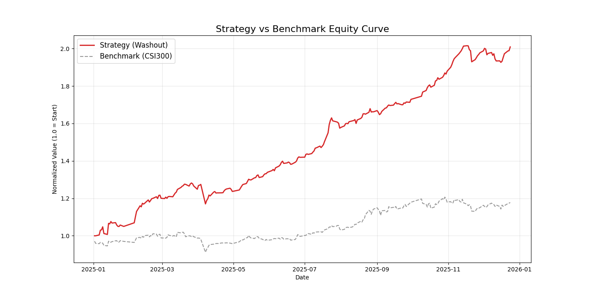

# LLM-Quant AI (A-Share)

LLM-Quant AI is an end-to-end quantitative research and trading system for the Chinese A-Share market. It captures cross-sectional alpha by fusing **GBDT factor modeling**, **sector rotation**, and **LLM-driven sentiment**, with an execution layer that emphasizes **Washout & Burst** entries.

---

## 1. Quantitative Methodology

The predictive objective is the expected return $\hat{r}_{t+k}$ over a horizon $k=5$ trading days, estimated from a composite feature space.

### 1.1 Feature Engineering (Factors)

We construct a multi-dimensional feature vector $X_t$ for each stock on day $t$.

**A. Quantitative Factor Model (Price/Volume Alpha via LightGBM)**  
Trained on Qlib’s factor set (Alpha158-style), optimized for A-Share microstructure noise.
- **Target (5D ref return):**
  $`Y^{\text{train}}_t = \frac{\mathrm{Ref}(\texttt{$close$},-5)}{\texttt{$close$}} - 1`$

- **Example hyperparameters:** learning rate $`=0.0421`$, $`num\_leaves = 210`$.

**B. Sector Rotation & Momentum (Cross-Sectional Regime Context)**  
Rank sectors/concepts daily to capture capital migration:
$`\text{Score}_{\text{sector}}=0.7\cdot \mathrm{Rank}(\text{Mom}_{5d}) + 0.3\cdot \mathrm{Rank}(\text{VolRatio}_{20d})`$
Concepts are dynamically mapped to constituents with caching to reduce API overhead.

**C. LLM-Driven Sentiment (Event/News Shock Filter)**  
RAG-like scoring for incremental news:
- **Entity extraction:** Jieba with custom A-Share dictionary to link tickers from Cailianshe streams.
- **Context injection:** Real-time float/market-cap to scale impact (substantial vs noise).
- **Scoring:**
  $`S=\text{Direction}\times \tanh(\text{Magnitude}\times \text{Certainty})`$

**Notation:** $`\mathrm{Rank}(\cdot)`$ is cross-sectional rank. $`\mathrm{Ref}(x,-k)`$ shifts $`x`$ forward by $`k`$ days.

### 1.2 Modeling & Labeling

**Task framing:** daily cross-sectional **Learning-to-Rank**.

- **Model:** LightGBM (GBDT)
- **Loss:** LambdaRank (or MSE with cross-sectional rank normalization)
- **Ranking:** $`\text{Score}_t = f_\theta(X_t)`$. Each day, stocks are ranked by $`\text{Score}_t`$; Top-K are candidates.

**Binary research label (optional):**
$`Y^{\text{class}}=\mathbf{1}\{Y^{\text{train}}_t>\tau\},\quad \tau=0.04`$

---

## 2. Architecture & Workflow

### System Stack

| Component      | Technology        | Description                                                 |
|---|---|---|
| Data Source    | AkShare           | East Money API for daily OHLCV, Turnover, concepts/news.    |
| Quotes DB      | ClickHouse        | High-performance OLAP for full-market quotes & factors.     |
| News DB        | MongoDB           | Document store for unstructured financial/news content.     |
| Framework      | Microsoft Qlib    | Data pipeline, factor calc, model training, backtesting.    |
| Model          | LightGBM          | GBDT for tabular cross-sectional prediction.                |

### Pipeline

Ingestion: AkShare → ClickHouse (+ MongoDB for news)  
ETL: ClickHouse → Qlib binary (.bin)  
Training: LightGBM on $`X_t`$ to predict $`Y^{\text{train}}_t`$ (5D)  
Inference: Generate daily $`\text{Score}_t`$ for full universe

**Strategy (Execution Overlay):**
- **Select:** Top 20 by AI Score (prediction).  
- **Filter (Washout bonus & liquidity):**
  - Add **+0.2** score if:
    - Turnover Rate $`\in [3.0\%,12.0\%]`$
    - Amplitude $`>4.0\%`$
    - Volume Ratio $`>1.2`$
  - Exclude **limit-up at open** names.
- **Rotate:** Daily rebalance (hold 1 day).

**Risk Controls (Exit):**
- **Hard stop:** P&L $`<-5\%`$  
- **Trailing stop:** if P&L $`>5\%`$ and drawdown from peak $`>3\%`$
- **Signal decay:** force exit if AI Score < 0 (bearish)

---

## 3. Performance (Backtest)

Evaluated versus CSI 300 (SH000300). For reproducibility, see training/validation ranges in Quick Start (e.g., Train: 2020–2023; Validate: 2024).

### Performance Comparison

| Metric              | Strategy (Alpha + Sentiment + Sector) | Benchmark (CSI 300) |
|---:|---:|---:|
| Total Return        | **100.89%** | 17.77% |
| Annualized Return   | **109.30%** | 18.91% |
| Sharpe Ratio        | **4.5067**  | 1.2021 |
| Max Drawdown        | **−8.71%**  | −10.49% |

**Equity Curve**  


**Analysis**  
The system behaves like a **beta-aware alpha**: sector rotation + sentiment boosts upside capture, while the washout filter enhances timing on thrust days. Risk remains sensitive to regime shifts and liquidity air-pockets; explicit market-timing gates further stabilize paths.

---

## 4. Future Investigation & Assessment

### Risk Management & Timing
- **Market Regime Filter:** Reduce/clear exposure if CSI 300 < 20-DMA or MACD death cross.  
- **Stop-Loss Enhancements:** Intraday breach of key support or gap-down beyond $`-5\%`$ triggers immediate/next-open exit.  
- **Position Sizing:** Vol-targeting (e.g., inverse realized $`\sigma`$) across selected names.

### Model Robustness
- **Rolling Walk-Forward:** Slide 3-year train window, predict next 6 months to track concept drift.  
- **Stress Tests:** Include 2015 crash, 2018 trade tensions, 2024 liquidity stress.

### Factor Mining
- **Microstructure:** Opening 30-minute capital flow and order-book imbalance.  
- **Sentiment Context:** Combine theme/sector heat and entity-level event windows to suppress pump-and-dump noise.

---

## 5. Quick Start

### Prerequisites
- ClickHouse (`stock_data` DB on default port)
- MongoDB (for news)
- Python 3.8+

### 5.1 Data Ingestion

```bash
# Historical market data & benchmarks
python data_ingestion/fetch_akshare.py
python data_ingestion/fetch_benchmark.py

# Concept/Sector constituents
python data_ingestion/fetch_concepts.py

# Real-time news
python data_ingestion/fetch_news.py
````

### 5.2 Factor Calculation & ETL

```bash
# Sector rotation backfill
python research/backfill_sector_rotation.py

# LLM sentiment (requires API key)
python research/strategy_llm.py

# Export ClickHouse → Qlib binary
python data_processing/export_to_qlib.py
```

### 5.3 Training & Prediction

```bash
# Train (2020–2023), validate (2024), and run backtest
python backtest/backtest.py

# Generate predictions for next session
python trade/predict_tomorrow.py
```

### 5.4 Execution

```bash
# Apply washout overlay and produce orders/positions
python trade/auto_trader.py
```

**Outputs**

* `trade/daily_scores.csv` — Model scores (pre/post washout bonus)
* `trade/positions.json` — Current portfolio and cost basis
